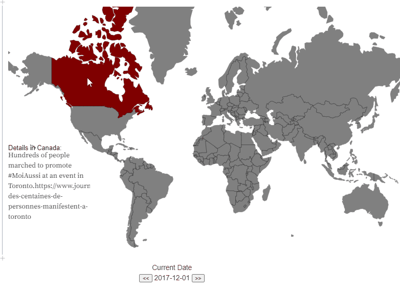
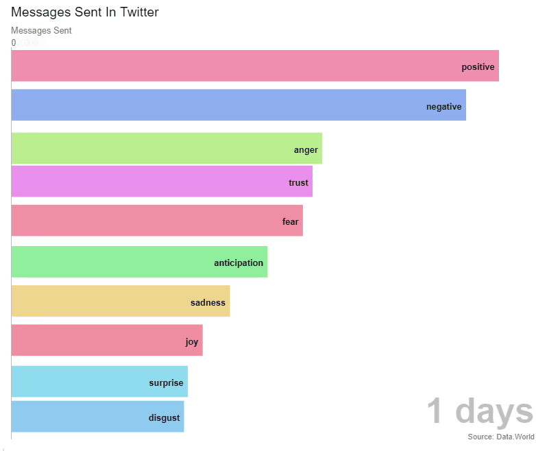
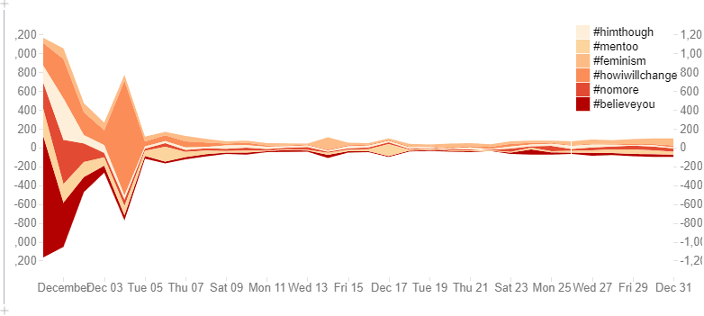

# How MeToo Movement Became Global?

In this project, we used three visualization methods to clearly visualize the global spread of the MeToo movement.

## World Graph
The world graph visualized the spread of #MeToo
movement over 30 days. Twenty countries and regions
were involved in the movement in a month. Canada was
the first, followed by countries in the mid Asia and
Europe. Japan and China engaged with this movement
eventually in 2017.

## Sentiment Analysis
The overall tone seems to be positive during the first
month of the #MeToo movement. The rapid surge of the
negative tone halfway implies the plausible exposure of
some events or scandals. The feeling of anger,
accompanied with trust, dominate people’s sentiment.
These findings sort of denote that expressing sympathy
and showing trust for the victims stimulate the global
transmission of the ##MeToo movement.

## Streamgraph
Streamgraph showed 6 important words appearances
trend during the first month of the #MeToo movement.
We saw #believeyou and #howiwillchange dominated
the first few days and all the words died down after the
first week.

The <b>detailed analysis</b> can be seen [here](https://github.com/tangramer/How-MeToo-Movement-Became-Global-/blob/main/%23MeToo%20Analysis.pdf)

The <b>final visualization web page</b> can be seen [here](https://observablehq.com/@tangramer/fp-how-metoo-movement-became-global)
